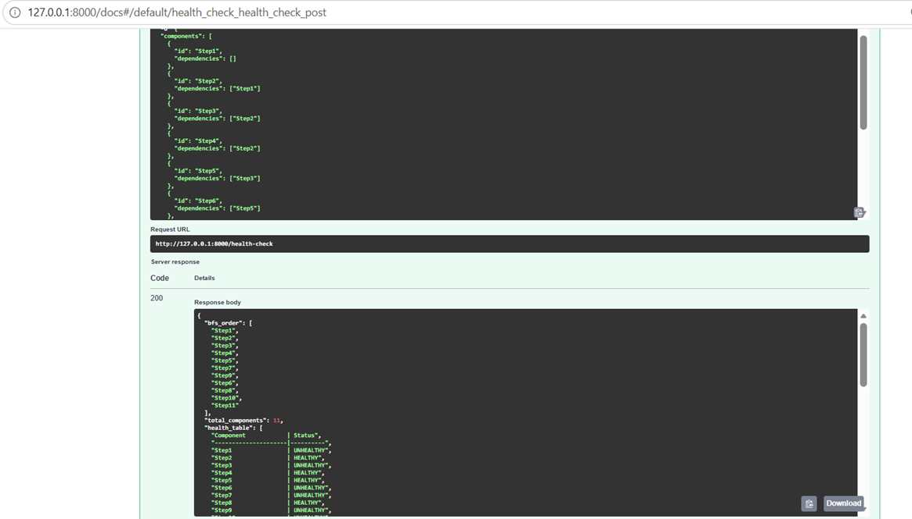

# System Health Check API

A FastAPI-based REST API that evaluates the health of a system composed of multiple interdependent components arranged as a Directed Acyclic Graph (DAG).

The solution constructs a DAG from JSON input, traverses the graph using Breadth-First Search (BFS), asynchronously evaluates component health, and returns aggregated health results.

## Technologies Used

- Python 3.11
- FastAPI
- BFS Graph Traversal
- Async Programming
- Pytest
- Docker
- Terraform
- GitHub Actions


## Architecture

Input JSON
        |
        v
Construct DAG
        |
        v
BFS Traversal
        |
        v
Async Health Checks
        |
        v
Aggregate Results
        |
        v
API Response


## Features Implemented

- DAG Construction from JSON input
- Breadth First Search (BFS) traversal
- Asynchronous health evaluation
- Aggregated system health reporting
- Swagger/OpenAPI documentation
- Unit testing using pytest
- Docker containerization
- Terraform infrastructure code
- GitHub Actions CI pipeline


# Assumptions

- Input graph is a valid Directed Acyclic Graph (DAG)
- Component IDs are unique
- Dependencies reference valid components
- Health checks are simulated asynchronously


## Design Decisions

### FastAPI
Chosen for lightweight API development and built-in Swagger support.

### BFS Traversal
Used to traverse system dependencies level-by-level.

### Async Processing
Allows multiple component health checks to execute concurrently.

### Docker
Ensures consistent execution across environments.

### GitHub Actions
Provides automated validation through Continuous Integration.


## Tradeoffs

- Simulated health checks instead of real service endpoints.
- Logging implemented, but advanced metrics and tracing were not included.
- Visualization provided through documentation rather than dynamic graph rendering.


## Observability

Current implementation includes:

- Application logging
- API response visibility
- Swagger documentation
- CI/CD validation through GitHub Actions

Potential future enhancements:

- Prometheus metrics
- OpenTelemetry tracing
- Grafana dashboards


## AI Usage

AI tools were used for:

- FastAPI implementation guidance
- Docker configuration guidance
- GitHub Actions workflow setup
- Documentation assistance

All generated suggestions were reviewed, tested, modified, and validated manually before inclusion in the solution.

## Sample DAG Validation

The solution was tested using a sample DAG containing 11 interconnected components.




## Run Locally

### Install Dependencies

```bash
pip install fastapi uvicorn pytest pydantic
```

### Start the Application

```bash
uvicorn app.main:app --reload
```

### Swagger Documentation

```text
http://127.0.0.1:8000/docs
```

## Docker

Build image:

docker build -t system-health-check-api .

Run container:

docker run -p 8000:8000 system-health-check-api
